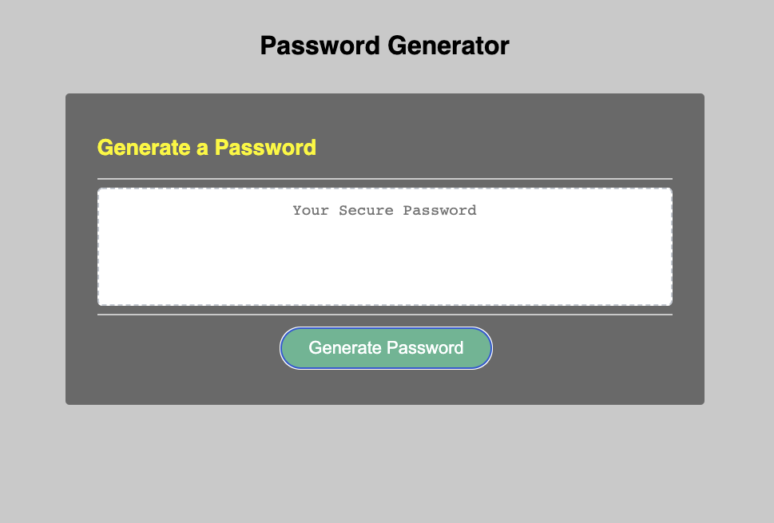

# Password-Generator

## Modify the starting js file to meet the following criteria:

```
Add a series of prompts for password criteria.

Enable user to select length and character types to include in the password.

Prompt user to choose and confirm length of at least 8 characters and no more 
than 128 characters.

Prompt user to choose and confirm whether or not to include lowercase, uppercase, 
numeric, and/or special characters.

Validate user input for meeting length parameters (8-128 characters) and in 
choosing at least one character type.

Generate a password that matches criteria from user input to all the prompts.

Display the generated password on the web page.

Adjust color palette in css file for readability of UI/UX.

```
## Deployed Application:

Here's a screenshot of the application's interface:




Here's a link to the deployed application: 
https://jehulie.github.io/Password-Generator/